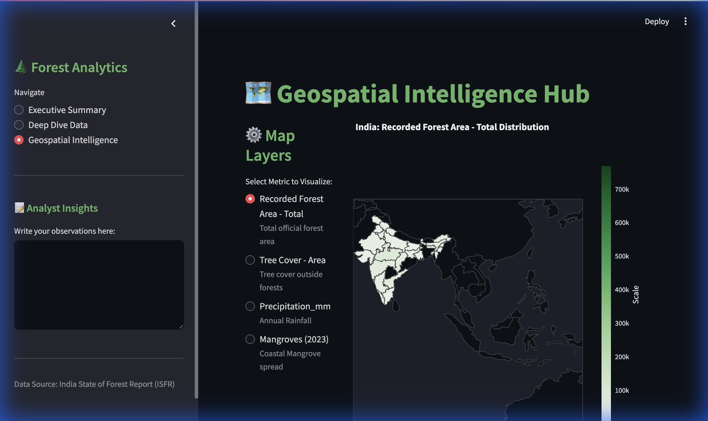

# 🌲 India Forestry Data Dashboard (1987-2023)



## 📌 Executive Summary
**"Unlocking 30 Years of Green Data."**

This project is a high-performance **Streamlit Data Dashboard** designed to analyze India's forest cover trends over three decades. It transforms complex government datasets (ISFR) into actionable insights, helping policymakers and analysts understand the delicate balance between **economic development** (Tree Cover) and **ecological preservation** (Forest Area).

Built with a **"Corporate-Ready"** design philosophy, it features a glassmorphism UI, a high-contrast dark mode, and interactive geospatial intelligence.

---

## 🚀 Key Features

### 1. 🗺️ Geospatial Intelligence Hub
- **Interactive Choropleth Maps**: A focused view of India (Lat 6-38, Lon 68-98) visualizing forest density, tree cover, and rainfall.
- **Dynamic Drill-Down**: Click on any state to generate an instant "Report Card" analyzing its ecological profile.
- **Plain English Insights**: Automated tooltips that translate technical metrics (e.g., *Recorded Forest Area*) into interview-ready explanations.

### 2. 📊 Deep Dive Analytics
- **Leaderboard Engine**: A custom-built ranking system identifying the **Top 5 Gainers & Losers** in forest cover since 2005.
- **Forest Quality Analysis**: Stacked area charts differentiating between *Reserved* (High Quality) and *Open* (Degraded) forests.
- **Correlation Engine**: Dual-axis charts exploring the relationship between annual rainfall and forest growth.

### 3. 🎨 Premium UI/UX
- **Dark Theme Reference**: Engineered with `#0e1117` backgrounds and `#228B22` (Forest Green) accents for reduced eye strain and professional aesthetics.
- **Glassmorphism**: Metrics cards feature frosted glass effects for a modern look.
- **Zero-Clutter Data**: Smart filtering removes aggregate noise (e.g., 'Total' rows) from leaderboards to ensure statistical accuracy.

---

## 🛠️ Technology Stack
- **Frontend**: Streamlit (Python)
- **Visualization**: Plotly Express & Graph Objects
- **Data Processing**: Pandas & NumPy
- **Geospatial**: GeoJSON Integration

---

## ⚙️ Installation & Setup

1. **Clone the Repository**
   ```bash
   git clone <repository_url>
   cd Project-3
   ```

2. **Install Dependencies**
   ```bash
   pip install -r requirements.txt
   ```

3. **Run the Dashboard**
   ```bash
   streamlit run app.py
   ```

---

## 📂 Project Structure

```text
├── app.py                 # Main Application Logic (UI, Charts, Layouts)
├── preprocessing.py       # Data Pipeline (Cleaning, Merging, Standardization)
├── requirements.txt       # Project Dependencies
├── assets/                # Images & Static Resources
│   └── banner.png         # Dashboard Preview
├── debug_map.py           # Utility for GeoJSON debugging
└── Data/                  # Source Datasets
    ├── national_trends.csv
    ├── state_forest_cover.csv
    └── ...
```

---

## 💡 Key Insights Generated
1. **The "Green Paradox"**: While total green cover has increased, significant portions are "Open Forest" (degraded) rather than "Very Dense Forest," indicating a quality vs. quantity trade-off.
2. **Rainfall Correlation**: States with higher average precipitation don't always correlate with higher *legal* forest area, suggesting urbanization is a stronger driver than climate in certain zones.
3. **Regional Leaders**: **Madhya Pradesh** continues to hold the largest forest area, while **North-Eastern states** show fluctuating trends due to shifting cultivation patterns.

---

### 👨‍💻 Author
**Prashant Singh**
*Data Analyst & Dashboard Engineer*
